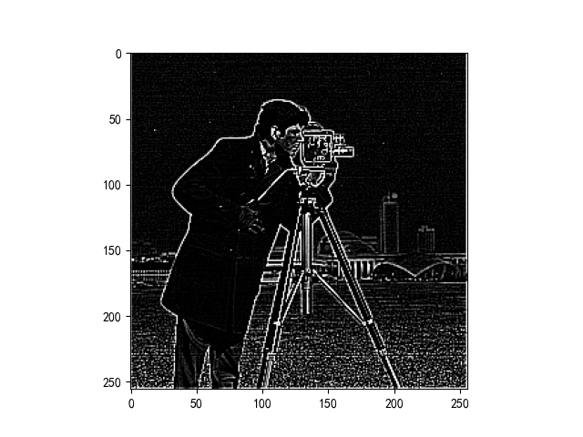
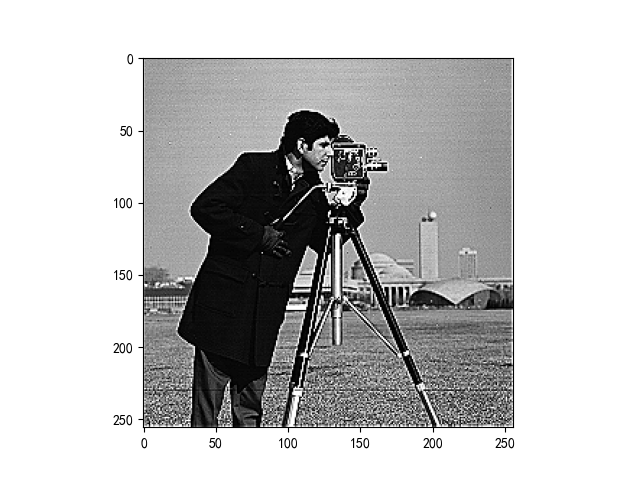
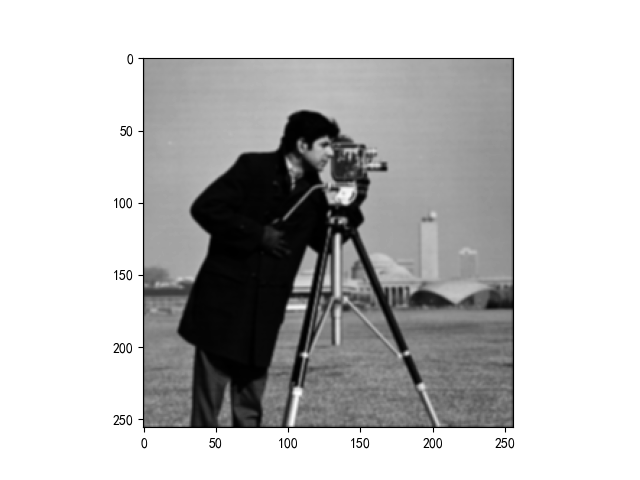
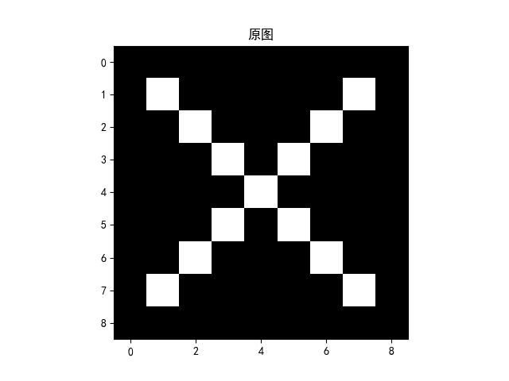
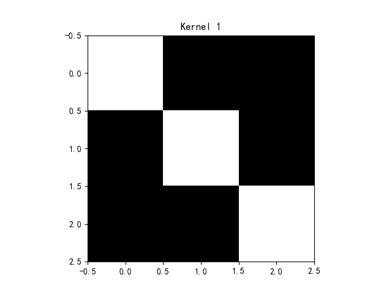
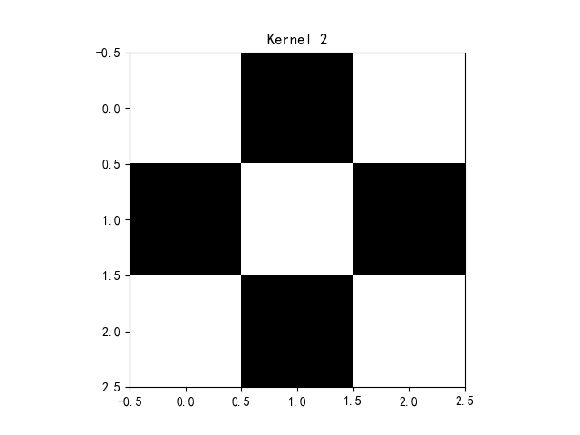
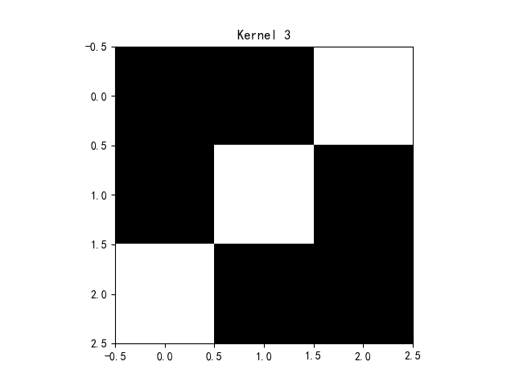
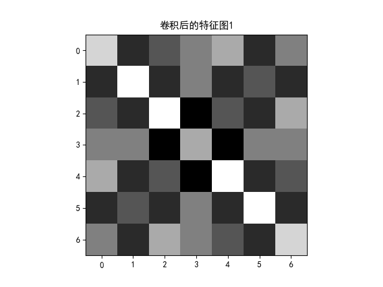
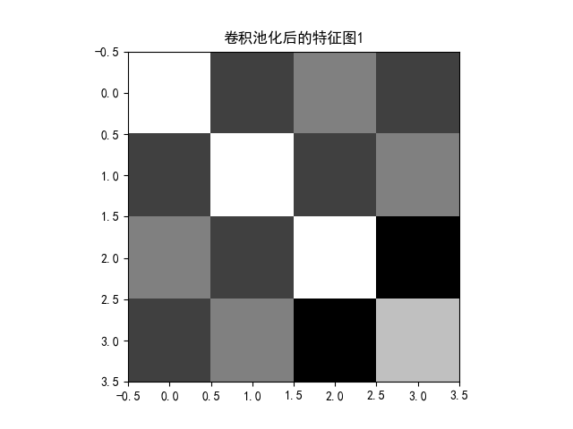
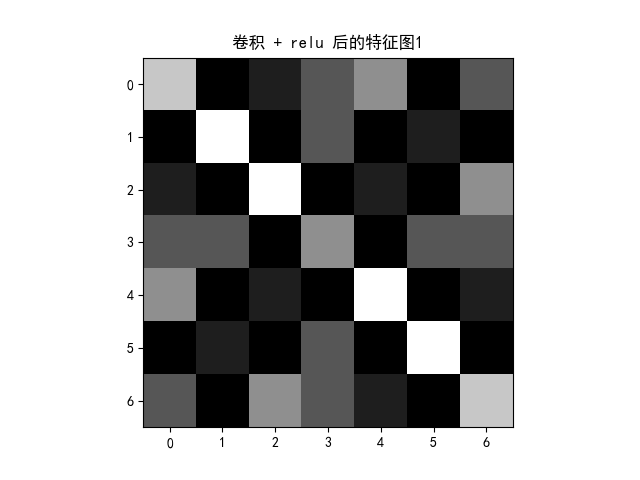

## 作业 1-ML 基础

**1、监督学习、无监督学习**

监督学习：从标注数据种学习预测模型

无监督学习：从无标记的训练数据中推断结论

**2、分类、回归**

分类：将事务分成特定的类型

回归：建立变量之间的函数关系

**3、聚类、降维**

聚类：常见的无监督算法，让样本聚成不同的类型

降维：降低数据的维度，主成分分析就含有降维技术

**4、损失函数**

损失函数：描述实际值与预测值差距的一种函数

**5、训练集、测试集、验证集**

训练集：用来训练模型以及确定参数

验证集：用于确定网络结构以及调整模型的超参数，来确定是否需要继续训练

测试集：用于检验模型的泛化能力，测试集用来形容模型能力的好坏

**6、过拟合、欠拟合**

过拟合：训练过度，只对训练集的效果好，对测试集的效果差

欠拟合：训练的不够，对训练集和测试集的效果都差

**7、经验风险、期望风险**

经验风险：经验风险来源于训练数据集，训练数据集的平均损失也称为经验风险。

期望风险：期望风险针对的是全体数据。也就是已有的数据，未有的数据都包括在内。


## 作业 2-监督学习

**1、结构风险最小**

结构风险最小化等价于正则化

**2、正则化**

损失函数中对网络超参数加权，防止过拟合

**3、线性回归**

预测连续值

**4、逻辑斯蒂回归**

将值确定在[0,1]之间，分类用的

**5、Sigmoid 与 SoftMax 函数**

前者用于二分类 后者用于多分类
$$
g(x) ={1\over 1+e^{-z} }\\\\
softmax(x)=softmax(\begin{bmatrix}x_{1}  & x_{2} & ... & x_{n}\end{bmatrix} )=\begin{bmatrix}e^{x_{1}} \over {\textstyle \sum_{j}^{} e^{xj}}   & e^{x_{2}} \over {\textstyle \sum_{j}^{} e^{xj}} & ... & e^{x_{n}} \over {\textstyle \sum_{j}^{} e^{xj}}\end{bmatrix}
$$

**6、决策树**

是一种基本的分类与回归方法

**7、信息熵 条件熵 信息增益**

信息熵度量不确定性

条件熵度量某种条件下的不确定性

信息增益代表了某种条件下，原始变量不确定性的减小程度

**8、线性判别分析 LDA**

将高纬度的通过投影降维 从而分类

**9、PAC**

同等条件下，模型越复杂泛化误差越大。同一模型在样本满足一定条件的情况下，样本数量越大，模型泛化误差越小，因此还可以说模型越复杂越吃样本

**10、Adaboost**

针对同一个训练集训练不同的弱分类器，然后把这些弱分类器集合起来，构成一个更强的强分类器


## 作业 3-监督学习

**1、集成学习**

通过训练若干个个体学习器，通过一定的结合策略，来完成学习任务。

**2、支持向量机**

尝试拟合两个类别之间最宽的间距

**3、软间隔**

软间隔是一种支持向量机中的概念，允许一定程度的分类错误，以便在处理线性不可分数据时达到更好的分类效果。

**4、核函数**

让原本在低维空间中线性不可分的数据变得在高维空间中线性可分。常见的有
$$
线性核函数K(x,y)=x^{T}y\\\\
多项式核函数K(x,y)=(x^Ty+c)^d\\\\
多项式径向基函数核K(x,y)=exp(- {\left \\| x-y \right \\| ^2 \over 2\sigma ^2})
$$
**5、VC 维**

度量机器学习算法的学习能力和泛化性能

**6、生成模型**

通过对观察数据的概率分布，生成与训练数据具有相似特征的新数据

**7、判别模型**

找到一个边界或者函数，以便根据输入数据准确地预测输出标签

**8、生成式模型和判别式模型优缺点**

生成式模型优点

- 可以学习数据的概率分布
- 对数据的结构和关系有更深入的理解

判别式模型优点

- 预测性能较好

- 计算效率较高
- 一个的优点就是另一个的缺点

**9、监督学习是判别式方法，无监督学习是生成式方法**

不正确，监督学习和无监督学习描述的是学习任务的类型，生成式方法和判别式方法描述的是模型的学习方式。

**10、分类是判别式方法，聚类是生成式方法？KNN，K-means 分别是什么方法？**

不正确，KNN 判别式，kmeans 生成式。


## 作业 4-无监督学习

**1、K 均值聚类**

一种常用的无监督学习算法，基于数据点之间的距离来进行聚类，通过最小化簇内点到簇中心的距离的平方和来进行优化。

**2、K 均值聚类是生成式还是判别式方法**

不是生成式也不是判别式。

**3、KNN VS K-means**

- 监督学习 vs 无监督学习：KNN 是一种监督学习算法，而 K-means 是一种无监督学习算法。
- 分类/回归 vs 聚类：KNN 用于分类和回归问题，而 K-means 用于聚类问题。
- 预测新数据点 vs 确定数据点的分组：KNN 用于预测新数据点的标签或数值，而 K-means 用于确定数据点的分组。
- K 值的含义不同：在 KNN 中，K 代表要考虑的最近邻居的数量，而在 K-means 中，K 代表要将数据点分成的簇的数量。

**4、主成分分析**

将高维数据映射到低维空间，从而实现对数据的降维和特征提取。

**5、LDA VS PCA**

- LDA 让映射后的样本有最好的分类性能。
- PCA 让映射后的样本有最大的发散性。

**6、奇异值分解（SVD）**

对于一个 $m \times n$ 的实矩阵 $A$，它的奇异值分解为：
$$
A=U Σ V^T
$$
其中，$U$ 是 $m \times n$ 的正交矩阵，$V$ 是 $n \times n$ 的正交矩阵，$Σ$ 是 $m \times n$ 的对角矩阵，对角线上的元素 $\sigma_{1},\sigma_{2}  , \cdots,\sigma_{r}  $ 称为 $A$ 的奇异值 $r = min(m,n)$。$Σ$ 的其余元素都是零。

具体来说，$U$ 和 $V$ 的列向量是 $AA^T$ 和 $A^TA$ 的特征向量，$Σ$ 的对角线元素是 $AA^T$ 和 $A^TA$ 的非零特征值的平方根。

**7、特征人脸方法（Eigenface）**

基于奇异值分解（SVD）的思想，通过计算训练集中人脸图像的主成分，从而得到一组人脸特征向量，这些特征向量被称为 Eigenface。

**8、潜在语义分析（LSA）**

基于奇异值分解（SVD）的文本挖掘技术，它通过将文本转化为向量空间模型，利用矩阵分解技术找到文本语义的潜在结构，从而实现文本的自动分类、聚类和相似性计算。

**9、期望最大化算法（EM）**

一种常用的统计学习算法，用于估计包含隐变量的概率模型的参数。它通过迭代的方式，交替进行两个步骤：E 步骤和 M 步骤，从而不断更新模型参数，直到收敛。

**10、K-means 是最简单的 EM 算法**

可以说 K-means 是 EM 算法的一种特殊情况，它可以看作是最简单的 EM 算法之一，但并不完全等同于 EM 算法。

**11、编程实现 EM 算法**

```python
import math

def cal_mu(w, p, q, xi):
    return w * math.pow(p, xi) * math.pow(1 - p, 1 - xi) / \
           float(w * math.pow(p, xi) * math.pow(1 - p, 1 - xi) +
                 (1 - w) * math.pow(q, xi) * math.pow(1 - q, 1 - xi))

def e_step(w, p, q, x):
    mu = [cal_mu(w, p, q, xi) for xi in x]
    return mu

def m_step(mu, x):
    w = sum(mu) / len(mu)
    p = sum([mu[i] * x[i] for i in range(len(mu))]) / sum(mu)
    q = sum([(1 - mu[i]) * x[i] for i in range(len(mu))]) / \
        sum([1 - mu[i] for i in range(len(mu))])
    return [w, p, q]

def run(x, w, p, q, maxiteration):
    for i in range(maxiteration):
        mu = e_step(w, p, q, x)
        print(i, [w, p, q])
        if [w, p, q] == m_step(mu, x):
            break
        else:
            [w, p, q] = m_step(mu, x)
    print([w, p, q])

if __name__ == "__main__":
    x = [1, 1, 0, 1, 0, 0, 1, 0, 1, 1]
    [w, p, q] = [0.4, 0.6, 0.7]
    run(x, w, p, q, 100)
```


## 作业 5-深度学习基础

**1、人工智能、机器学习、深度学习之间的关系**

- 人工智能是一种广义的概念。
- 机器学习是一种实现人工智能的技术。

- 深度学习是一种机器学习的子领域，它使用深度神经网络来实现自动化学习和预测分析。

**2、神经网络与深度学习的关系**

- 神经网络是一种数学模型，它由一个或多个神经元组成，可以通过对输入数据的处理来进行分类、回归或者聚类等任务。
- 深度学习则是基于神经网络的一种特殊形式，它是一种通过组合多个神经元层来构建更加复杂的模型，从而实现对大规模数据进行学习和推断的方法。


**3、深度学习和传统浅层学习的区别和联系**

- 传统浅层学习是指传统的机器学习方法,深度学习采用深度神经网络来实现自动化学习和预测分析。
- 在联系方面，深度学习和传统浅层学习都是机器学习的分支，都是使用数据来进行预测和分类的。


**4、神经元、人工神经元**

- 神经元是生物学中的一种细胞，是神经系统的基本功能单元。
- 人工神经元是一种数学模型，它模仿了生物神经元的结构和功能，可以接收输入信号、处理信息、产生输出信号。人工神经元通常由多个输入端口和一个输出端口组成。


**5、MP 模型**

MP 模型的神经元有两种状态，分别为激活（active）和抑制（inactive）状态。当神经元接收到的输入信号超过了一个阈值时，它就会被激活，产生一个输出信号，否则它就处于抑制状态，不产生输出信号。

**6、单层感知机 SLP**

单层感知机是一种最早的神经网络模型之一，基于线性分类器的模型，可以用于解决二分类问题。

**7、异或问题 XOR**

异或问题是一个在传统浅层神经网络中无法解决的问题。解决异或问题的方法是使用多层神经网络，比如多层感知机。

**8、多层感知机 MLP**

多层感知机是一种前馈神经网络，由多个神经网络层组成，其中每个神经网络层都由多个神经元组成。

**9、前馈神经网络 FNN**

前馈神经网络是一种最基本的神经网络模型，也被称为多层感知机。

**10、激活函数 Activation Function**

在神经网络中，激活函数是将神经元的输入信号转换为输出信号的非线性函数。

**11、为什么要使用激活函数？**

- 引入非线性特性
- 增强神经网络的表达能力
- 提高模型的稳定性
- 梯度下降算法的实现

**12、常用激活函数有哪些？**

- sigmoid 函数：$f(x)=\frac{1}{1+e^{-x}}$
- ReLU  函数：$f(x)=max(0,x)$
- tanh 函数：$f(x)=\frac{e^{x}-e^{-x}}{e^{x}+e^{-x}}$

**13、均方误差和交叉熵损失函数，哪个适合于分类？哪个适合于回归？为什么？**

对于分类问题，通常使用交叉熵损失函数，对于回归问题，通常使用均方误差损失函数。

交叉熵损失函数适合于分类问题，特别是多分类问题。它的优点是可以有效地处理分类问题中的概率分布，而且当预测结果与真实结果差距较大时，损失函数的值会迅速增大，从而更容易发现错误。此外，交叉熵损失函数的梯度计算也比较简单，便于优化算法的实现。

均方误差损失函数适合于回归问题，特别是对于数值预测问题，它可以测量预测值与真实值之间的平方差，因此可以使得预测值尽可能地接近真实值。此外，均方误差损失函数也可以很好地处理离群值，因为它对预测误差的平方进行求和，因此离群值的影响相对较小。


## 作业 6-误差反向传播

**1、梯度下降**

梯度下降是一种用于优化函数的迭代算法，通常用于训练机器学习模型。其核心思想是通过迭代的方式逐步调整模型参数，使得损失函数的值不断减小，从而使得模型的预测结果更加准确。

**2、反向传播**

反向传播是一种用于计算神经网络中权重和偏置梯度的算法，通常与梯度下降一起使用来训练神经网络。

**3、计算图**

计算图是一种用于表示数学运算的图形化表示法，它通常用于机器学习和深度学习中。计算图由节点和边组成，其中节点表示数学运算，边表示数据流动。

**4、使用 numpy 编程实现例题**

**4.1 初始化**

```python
def initialize_parameters(n_x, n_h, n_y):
    np.random.seed(int(time.time()))
    W1 = np.random.randn(n_h, n_x) * 0.01
    b1 = np.zeros((n_h, 1))
    W2 = np.random.randn(n_y, n_h) * 0.01
    b2 = np.zeros((n_y, 1))
    parameters = {"W1": W1,
                  "b1": b1,
                  "W2": W2,
                  "b2": b2}
    return parameters
```

**4.2 正向传播模块**

**4.2.1 线性正向**

```python
def linear_forward(A, W, b):
    Z = np.dot(W, A) + b
    cache = (A, W, b)
    return Z, cache
```

**4.2.2 正向线性激活**

```python
def linear_activation_forward(A_prev, W, b, activation):
    if activation == "sigmoid":
        Z, linear_cache = linear_forward(A_prev, W, b)
        A, activation_cache = sigmoid(Z)
    elif activation == "relu":
        Z, linear_cache = linear_forward(A_prev, W, b)
        A, activation_cache = relu(Z)
    cache = (linear_cache, activation_cache)
    return A, cache
```

**4.3 损失函数**

```python
def compute_cost(AL, Y):
    m = Y.shape[1]
    cost = -1 / m * np.sum(Y * np.log(AL) + (1 - Y) * np.log(1 - AL), axis=1, keepdims=True)
    cost = np.squeeze(cost)
    return cost
```

**4.4 反向传播模块**

**4.4.1 线性反向**

```python
def linear_backward(dZ, cache):
    A_prev, W, b = cache
    m = A_prev.shape[1]
    dW = 1 / m * np.dot(dZ, A_prev.T)
    db = 1 / m * np.sum(dZ, axis=1, keepdims=True)
    dA_prev = np.dot(W.T, dZ)
    return dA_prev, dW, db
```

**4.4.2 反向线性激活**

```python
def linear_activation_backward(dA, cache, activation):
    linear_cache, activation_cache = cache
    if activation == "relu":
        dZ = relu_backward(dA, activation_cache)
        dA_prev, dW, db = linear_backward(dZ, linear_cache)
    elif activation == "sigmoid":
        dZ = sigmoid_backward(dA, activation_cache)
        dA_prev, dW, db = linear_backward(dZ, linear_cache)
    return dA_prev, dW, db
```

**4.4.3 更新参数**

```python
def update_parameters(parameters, grads, learning_rate):
    L = len(parameters) // 2
    for l in range(L):
        parameters["W" + str(l + 1)] = parameters["W" + str(l + 1)] - learning_rate * grads["dW" + str(l + 1)]
        parameters["b" + str(l + 1)] = parameters["b" + str(l + 1)] - learning_rate * grads["db" + str(l + 1)]
    return parameters
```


**5、使用 PyTorch 的 Backward() 编程实现例题**

```python
import torch

x_data = torch.tensor([[1.0], [2.0], [3.0]])
y_data = torch.tensor([[2.0], [4.0], [6.0]])


class LinearModel(torch.nn.Module):
    def __init__(self):
        super(LinearModel, self).__init__()
        self.linear = torch.nn.Linear(1, 1)

    def forward(self, x):
        y_pred = self.linear(x)
        return y_pred


model = LinearModel()

criterion = torch.nn.MSELoss(reduction='sum')
optimizer = torch.optim.SGD(model.parameters(), lr=0.01)

for epoch in range(100):
    y_pred = model(x_data)
    loss = criterion(y_pred, y_data)
    print(epoch, loss.item())

    optimizer.zero_grad()
    loss.backward()
    optimizer.step()

print('w = ', model.linear.weight.item())
print('b = ', model.linear.bias.item())

x_test = torch.tensor([[4.0]])
y_test = model(x_test)
print('y_pred = ', y_test.data)
```


## 作业 7-卷积

**1、简单描述卷积、卷积核、多通道、特征图、特征选择概念**

- 卷积：卷积核与输入数据进行按元素相乘并求和的操作。

- 卷积核：卷积核是一个小型矩阵，用于在卷积过程中与输入数据进行逐元素相乘并求和的操作。

- 多通道：多通道是指输入数据具有多个维度。

- 特征图：特征图是卷积操作后得到的输出数据。

- 特征选择：特征选择是机器学习中一种降低模型复杂度、提高泛化能力的方法。


**2、边缘检测**


```python
import numpy as np
import torch
from torch import nn
from torch.autograd import Variable
from PIL import Image
import matplotlib.pyplot as plt

plt.rcParams['font.sans-serif'] = ['SimHei']
plt.rcParams['axes.unicode_minus'] = False
file_path = 'Cameraman.tif'
im = Image.open(file_path).convert('L')
im = np.array(im, dtype='float32')
print(im.shape[0], im.shape[1])

plt.imshow(im.astype('uint8'), cmap='gray')
plt.title('原图')
plt.show()

im = torch.from_numpy(im.reshape((1, 1, im.shape[0], im.shape[1])))
conv1 = nn.Conv2d(1, 1, 3, bias=False, padding=1)

sobel_kernel = np.array([[-1, -1, -1],
                         [-1, 8, -1],
                         [-1, -1, -1]], dtype='float32') # 卷积核
sobel_kernel = sobel_kernel.reshape((1, 1, 3, 3))
conv1.weight.data = torch.from_numpy(sobel_kernel)

edge1 = conv1(Variable(im))
for i in range(edge1.shape[2]):
    for j in range(edge1.shape[3]):
        if edge1[0][0][i][j] > 255:
            edge1[0][0][i][j] = 255
        if edge1[0][0][i][j] < 0:
            edge1[0][0][i][j] = 0
x = edge1.data.squeeze().numpy()
print(x.shape)

plt.imshow(x, cmap='gray')

plt.show()
```





**3、锐化**

```python
sobel_kernel = np.array([[0, -1, 0],
                         [-1, 5, -1],
                         [0, -1, 0]], dtype='float32')
```



**4、模糊**

```python
sobel_kernel = np.array([[0.0625, 0.125, 0.0625],
                         [0.125, 0.25, 0.125],
                         [0.0625, 0.125,0.0625]], dtype='float32')
```




## 作业 8-卷积 2

**1、步长、填充**

- 步长（stride）：在卷积神经网络中，步长表示滤波器（卷积核）在输入数据上滑动的距离。
- 填充（padding）：在卷积神经网络中，填充是在输入数据周围添加额外的“像素”或“值”，以便在应用卷积核时保持输入和输出的尺寸。


**2、感受野**

感受野是指输出特征图中一个神经元所对应的输入数据区域

**3、局部感知、权值共享**

- 局部感知是指在卷积神经网络中，神经元只对其输入的一小部分区域做出响应
- 权值共享是指在卷积神经网络中，多个神经元共享同一组参数，这个参数组被称为卷积核


**4、池化（子采样、降采样、汇聚）**

是卷积神经网络中的一种操作。它通常紧跟在卷积层后面，用于减小特征图（Feature Map）的尺寸和数量，同时保留输入数据的重要特征。

**5、低级特征、中级特征、高级特征**

- 低级特征通常指一些较为基础的、直接从原始数据中提取的特征，如颜色、纹理、边缘等，它们通常对于物体的分类或识别任务并不十分有效，但是可以作为中级特征的基础。
- 中级特征则是指基于低级特征构建的一些更高层次的特征，如形状、轮廓、纹理组合等，这些特征能够更好地描述物体的形态和结构，因此对于分类或识别任务的效果会更好。

- 高级特征则是指基于中级特征构建的更加抽象和复杂的特征，如物体的部件、结构、语义等，这些特征能够更好地描述物体的高层次语义信息，因此对于更加复杂的任务（如目标检测、语义分割等）的效果会更好。


## 作业 9-卷积 3-XO 识别

**Code：**

```python
import torch
import torch.nn as nn
import matplotlib.pyplot as plt

plt.rcParams['font.sans-serif'] = ['SimHei']  # 用来正常显示中文标签
plt.rcParams['axes.unicode_minus'] = False  # 用来正常显示负号 #有中文出现的情况，需要u'内容
x = torch.tensor([[[[-1, -1, -1, -1, -1, -1, -1, -1, -1],
                    [-1, 1, -1, -1, -1, -1, -1, 1, -1],
                    [-1, -1, 1, -1, -1, -1, 1, -1, -1],
                    [-1, -1, -1, 1, -1, 1, -1, -1, -1],
                    [-1, -1, -1, -1, 1, -1, -1, -1, -1],
                    [-1, -1, -1, 1, -1, 1, -1, -1, -1],
                    [-1, -1, 1, -1, -1, -1, 1, -1, -1],
                    [-1, 1, -1, -1, -1, -1, -1, 1, -1],
                    [-1, -1, -1, -1, -1, -1, -1, -1, -1]]]], dtype=torch.float)
print(x.shape)
print(x)
img = x.data.squeeze().numpy()  # 将输出转换为图片的格式
plt.imshow(img, cmap='gray')
plt.title('原图')
plt.show()

print("--------------- 卷积  ---------------")
conv1 = nn.Conv2d(1, 1, (3, 3), 1)  # in_channel , out_channel , kennel_size , stride
conv1.weight.data = torch.Tensor([[[[1, -1, -1],
                                    [-1, 1, -1],
                                    [-1, -1, 1]]
                                   ]])
img = conv1.weight.data.squeeze().numpy()  # 将输出转换为图片的格式
plt.imshow(img, cmap='gray')
plt.title('Kernel 1')
plt.show()
conv2 = nn.Conv2d(1, 1, (3, 3), 1)  # in_channel , out_channel , kennel_size , stride
conv2.weight.data = torch.Tensor([[[[1, -1, 1],
                                    [-1, 1, -1],
                                    [1, -1, 1]]
                                   ]])
img = conv2.weight.data.squeeze().numpy()  # 将输出转换为图片的格式
plt.imshow(img, cmap='gray')
plt.title('Kernel 2')
plt.show()
conv3 = nn.Conv2d(1, 1, (3, 3), 1)  # in_channel , out_channel , kennel_size , stride
conv3.weight.data = torch.Tensor([[[[-1, -1, 1],
                                    [-1, 1, -1],
                                    [1, -1, -1]]
                                   ]])
img = conv3.weight.data.squeeze().numpy()  # 将输出转换为图片的格式
plt.imshow(img, cmap='gray')
plt.title('Kernel 3')
plt.show()

feature_map1 = conv1(x)
feature_map2 = conv2(x)
feature_map3 = conv3(x)

print(feature_map1 / 9)
print(feature_map2 / 9)
print(feature_map3 / 9)

img = feature_map1.data.squeeze().numpy()  # 将输出转换为图片的格式
plt.imshow(img, cmap='gray')
plt.title('卷积后的特征图1')
plt.show()

print("--------------- 池化  ---------------")
max_pool = nn.MaxPool2d(2, padding=0, stride=2)  # Pooling
zeroPad = nn.ZeroPad2d(padding=(0, 1, 0, 1))  # pad 0 , Left Right Up Down

feature_map_pad_0_1 = zeroPad(feature_map1)
feature_pool_1 = max_pool(feature_map_pad_0_1)
feature_map_pad_0_2 = zeroPad(feature_map2)
feature_pool_2 = max_pool(feature_map_pad_0_2)
feature_map_pad_0_3 = zeroPad(feature_map3)
feature_pool_3 = max_pool(feature_map_pad_0_3)

print(feature_pool_1.size())
print(feature_pool_1 / 9)
print(feature_pool_2 / 9)
print(feature_pool_3 / 9)
img = feature_pool_1.data.squeeze().numpy()  # 将输出转换为图片的格式
plt.imshow(img, cmap='gray')
plt.title('卷积池化后的特征图1')
plt.show()

print("--------------- 激活  ---------------")
activation_function = nn.ReLU()

feature_relu1 = activation_function(feature_map1)
feature_relu2 = activation_function(feature_map2)
feature_relu3 = activation_function(feature_map3)
print(feature_relu1 / 9)
print(feature_relu2 / 9)
print(feature_relu3 / 9)
img = feature_relu1.data.squeeze().numpy()  # 将输出转换为图片的格式
plt.imshow(img, cmap='gray')
plt.title('卷积 + relu 后的特征图1')
plt.show()
```

**Output：**
















## 作业 10-经典卷积网络

**LeNet & MNIST**

LeNet 是由 Yann LeCun 及其合作者于 1998 年开发的一种具有开创性的卷积神经网络架构。它的设计目的是识别手写数字并执行图像分类任务。MNIST 是一个用于手写数字识别的大型数据库，常被用于训练图像处理系统。LeNet 与 MNIST 的关系在于，LeNet 经常被用于 MNIST 数据集的训练和测试。

**AlexNet & CIFAR**

AlexNet 是由 Alex Krizhevsky，Ilya Sutskever 和 Geoffrey Hinton 在2012年开发的深度卷积神经网络架构。AlexNet 包含多个卷积层、池化层、全连接层和激活函数，并引入了 Dropout 技术以减少过拟合现象。CIFAR 是一个包含两个子数据集的图像分类数据库：CIFAR-10 和 CIFAR-100。尽管 AlexNet 最初是针对 ImageNet 数据集开发的，但它的架构和训练方法也可以应用于其他图像分类任务，如CIFAR 数据集。

**VGG Net**

VGG Net 是一种深度卷积神经网络架构，由 Oxford University 的 Visual Geometry Group（VGG）团队于2014年开发。VGG Net 在当年的 ImageNet 大规模视觉识别挑战（ILSVRC）中取得了优异成绩，以其简洁的结构和卓越的性能获得了广泛关注。VGG Net 的核心思想是通过使用较小的卷积核（如3x3）和多个连续卷积层来增加网络深度，从而提高模型的表达能力。VGG Net 有多个版本，如 VGG-16和 VGG-19，这些数字代表网络中包含的权重层（卷积层和全连接层）的数量。

**GoogLeNet & Inception v1**

GoogLeNet 是一种深度卷积神经网络架构，由 Google 的研究人员于2014年开发。GGoogLeNet 的核心创新是引入了一种名为 Inception 的模块结构，因此 GoogLeNet 有时也被称为 Inception v1。Inception 模块的主要思想是将多个卷积核大小的卷积层和池化层并行堆叠，从而在不同尺度上捕捉图像特征。具体而言，Inception 模块包含 1x1、3x3、5x5 的卷积层（加入 1x1 卷积层进行降维以减少计算量）和 3x3 最大池化层。这些层在同一级别并行操作，然后将它们的输出连接起来，形成一个更丰富的特征表示。

**ResNet**

ResNet（Residual Network）是由 Kaiming He, Xiangyu Zhang, Shaoqing Ren 和 Jian Sun 于 2015 年提出的一种深度卷积神经网络架构。ResNet 在 2015 年的 ImageNet 大规模视觉识别挑战（ILSVRC）中获得了冠军，同时在分类、定位、检测和分割等任务上取得了前所未有的成绩。ResNet 的关键创新是引入残差连接（residual connections）来解决深度神经网络中的梯度消失和退化问题。


## 作业 11-RNN

**1、前馈网络存在的问题**

- 梯度消失/梯度爆炸问题：在深度前馈网络中，当使用如sigmoid或tanh等饱和性激活函数时，网络在训练过程中可能会出现梯度消失的问题。这就导致了网络参数很难更新，进而影响网络的学习。相反，如果梯度过大，则可能会导致梯度爆炸，使得网络训练变得不稳定。
- 过拟合问题：前馈网络可能会过度拟合训练数据，这就使得网络在新的、未见过的数据上表现得不好。这个问题可以通过正则化技术，如权重衰减、Dropout等方法来缓解。

- 不能处理时序数据：前馈网络无法处理时序数据或者序列数据，因为它们没有记忆功能，无法保存先前的状态或输出。这对于理解语音、文本等顺序数据非常重要。而这一点可以通过引入RNN或LSTM等模型来解决。


**2、序列数据**

序列数据是一种数据类型，其中的元素存在特定的顺序。

**3、循环神经网络（RNN）为什么能解决前馈网络中的问题**

- 处理变长序列：RNN通过在序列的每个元素上一次处理一个元素来操作。这就意味着它可以处理任何长度的序列。
- 获取时间/空间的上下文信息：RNN的核心思想是有一个循环的隐藏状态，这个隐藏状态可以保存并更新过去的信息。因此，RNN在处理当前输入时，可以利用隐藏状态获取过去的信息。

**4、卷积神经网络（CNN）与循环神经网络（RNN）的异同**

相同点：

- 深度学习模型：CNN和RNN都是深度学习的模型，使用了神经网络的结构，并通过反向传播和梯度下降等优化算法进行训练。
- 非线性映射：它们都可以学习输入和输出之间的复杂非线性映射。
- 参数共享：CNN和RNN都使用参数共享的策略。CNN在所有空间位置共享其核的参数，RNN在时间步骤中共享其参数。

不同点：

- 数据类型：CNN主要用于处理网格型数据，如图像和音频。RNN主要处理序列数据，如时间序列和文本。
- 结构：CNN有卷积层和池化层，主要用于局部感知和降维。RNN有循环层，可以处理序列数据，能够在时间步骤中传递信息。
- 空间/时间依赖性：CNN通过使用卷积核来学习局部特征，适合于处理固定长度的输入（如固定大小的图像），对空间依赖性有很好的处理能力。RNN可以处理任何长度的序列，对于长期的时间依赖性，标准的RNN处理起来有困难，但LSTM或GRU等RNN的变体可以很好地解决这个问题。
- 并行计算：CNN的前向和后向传播都可以高效地并行化，因为其卷积操作在所有位置都是独立的。但RNN由于其序列依赖性，在时间步骤上难以进行有效的并行化。

**5、沿时间反向传播算法（BPTT）**

沿时间反向传播（Backpropagation Through Time, BPTT）是一种用于训练循环神经网络（RNN）的方法。它是标准反向传播算法的一个特例，适用于具有循环（即反馈连接）的网络。

**6、序列到序列模型 seq2seq**

序列到序列模型是一种在深度学习中用于生成序列的模型，特别适用于那些输入和输出都是序列的问题，如机器翻译、语音识别、文本摘要等。由编码器和解码器两部分组成。

**7、梯度消失、梯度爆炸**

梯度消失：当网络深度增加时，网络中的梯度可能会变得非常小。这意味着在反向传播过程中，当梯度传播到靠近输入层的网络部分时，它们的值可能已经变得非常接近于零。结果是，这些层的权重几乎没有更新，使得训练过程变得非常慢或者完全停止。

梯度爆炸：与梯度消失相反，梯度爆炸是指在训练过程中，梯度变得非常大，这会导致权重更新过大，使得网络不稳定。


## 作业 12-LSTM

**长短期记忆网络 LSTM（输入门、遗忘门、输出门）**

长短期记忆网络是一种特殊的递归神经网络，它通过特别设计的网络结构来解决普通RNN在处理长序列数据时的梯度消失和爆炸问题。

- 输入门（Input Gate）：决定我们要在记忆细胞中存储多少来自输入的新信息。它由两部分组成，一个是sigmoid层，另一个是tanh层。sigmoid层输出0到1之间的值，表示我们要保存多少新信息，0表示“什么都不保存”，1表示“保存所有”，而tanh层则生成新的候选值，可能会被加入到状态中。
- 遗忘门（Forget Gate）：决定我们要从记忆细胞中遗忘多少信息。它的作用是通过丢弃不再需要的信息，来保持细胞状态的有效性和简洁性。它是一个sigmoid层，输出0到1之间的值，0表示“完全忘记”，1表示“完全记住”。
- 输出门（Output Gate）：根据当前输入和细胞状态，决定输出多少细胞的新状态。它由一个sigmoid层和一个tanh层组成。sigmoid层决定我们要输出哪部分信息，而tanh层则将细胞状态转换到-1到1之间，然后与sigmoid的输出相乘，最后输出我们想要的信息。

**LSTM 如何克服梯度消失**

LSTM 在计算过程中，会有一条“细胞状态”直接在各个时间步之间传递。在每个时间步，都会有一些信息被遗忘，一些新信息被添加进来。这个过程通过“遗忘门”和“输入门”来控制。因为细胞状态的这种线性传递性，使得LSTM能够在一定程度上避免梯度消失问题。

**门控循环单元神经网络 GRU（更新门、重置门）**

GRU 网络主要有两个门，即更新门和重置门：

- 更新门（Update Gate）：更新门帮助模型决定何时“忘记”以前的隐藏状态，何时使用新的候选隐藏状态。更新门的值越接近1，模型就越倾向于保留以前的隐藏状态；更新门的值越接近0，模型就越倾向于使用新的候选隐藏状态。更新门的设计帮助GRU捕捉和存储长序列中的依赖关系。
- 重置门（Reset Gate）：重置门帮助模型决定在计算新的候选隐藏状态时，是否要“忽视”以前的隐藏状态。重置门的值越接近1，模型就越倾向于“考虑”以前的隐藏状态；重置门的值越接近0，模型就越倾向于“忽视”以前的隐藏状态。重置门的设计使得GRU可以在不同程度上利用以前的隐藏状态，有助于捕捉序列中的复杂模式。
